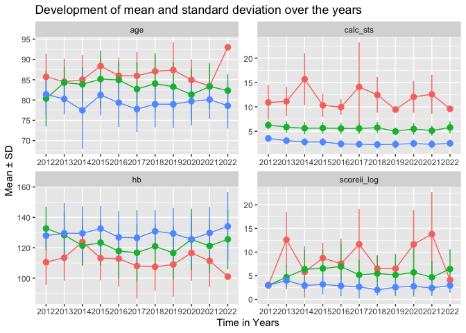
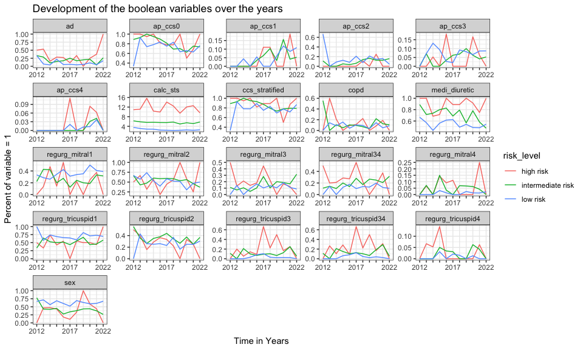
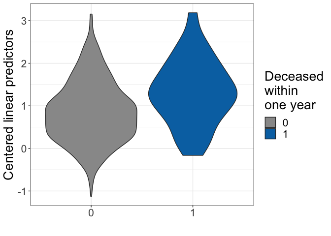
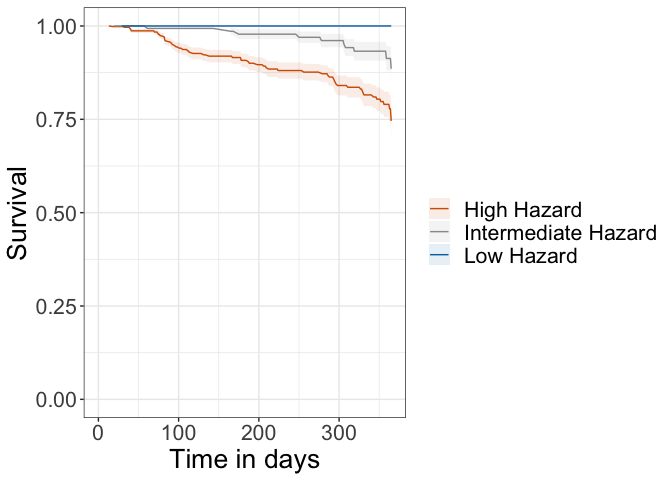
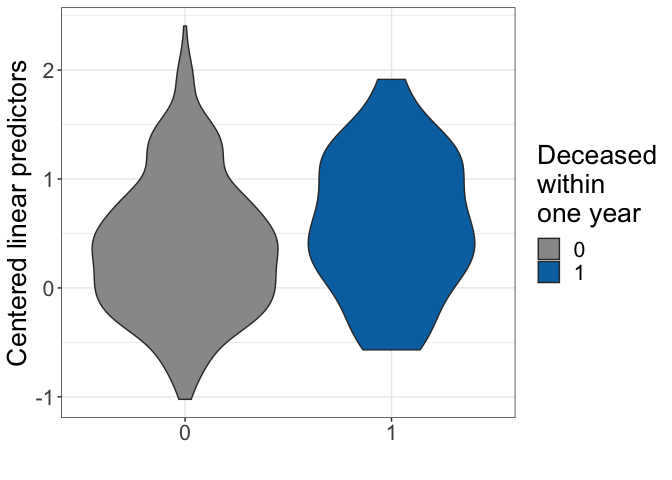
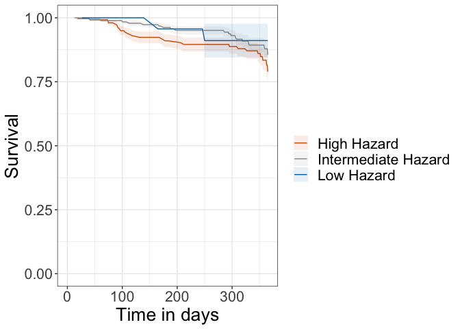
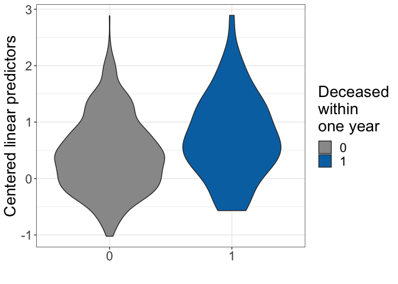
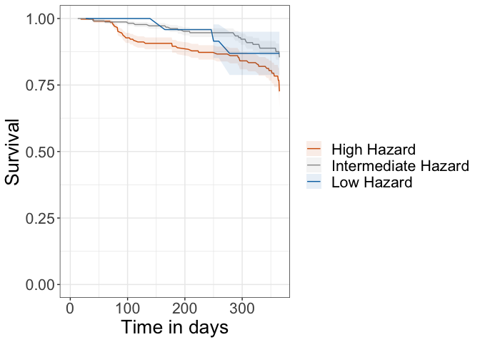

# Evaluating the models on the Luzern cohort

## Imports

    library(data.table)
    source('../00_data_preparation/utils.R')
    library(tidyr)
    library(ggplot2)
    source('../02_models/utils.R')
    library(glmnet)

    ## Loading required package: Matrix

    ## 
    ## Attaching package: 'Matrix'

    ## The following objects are masked from 'package:tidyr':
    ## 
    ##     expand, pack, unpack

    ## Loaded glmnet 4.1-4

    library(survival)
    library(survAUC)
    library(caret)

    ## Loading required package: lattice

    ## 
    ## Attaching package: 'caret'

    ## The following object is masked from 'package:survival':
    ## 
    ##     cluster

    cbPalette <- c("#999999", "#E69F00", "#56B4E9", "#009E73", "#F0E442", "#0072B2", "#D55E00", "#CC79A7")

## Cohort properties

The dataset was preprocessed with `03_testset/prepare_test_set.R`. We
first read it in.

    test_dt <- fread('../testset_table1yrAllCause.csv')
    head(test_dt)

    ##        Patient time event  proc_date  age sex copd scoreii_log calc_sts  hb ad
    ## 1: 000-218-27X  335     0 2019-11-12 80.1   0    0         1.7     1.50 141  0
    ## 2: 004-770-023   34     0 2016-03-08 78.5   1    1         4.3     2.42 138  0
    ## 3: 005-628-322  237     0 2016-07-28 79.2   1    0         1.4     2.00 142  0
    ## 4: 006-172-042   32     0 2019-04-11 81.4   1    0         3.0     3.60 110  0
    ## 5: 007-840-911   35     0 2018-12-13 78.4   1    1         2.0     3.10 110  1
    ## 6: 010-776-739   31     0 2014-11-18 70.3   1    0         3.4     2.80 144  1
    ##    medi_diuretic regurg_mitral1 regurg_mitral2 regurg_mitral3 regurg_mitral4
    ## 1:             0              0              1              0              0
    ## 2:             1              1              0              0              0
    ## 3:             1              0              0              1              0
    ## 4:             1              0              1              0              0
    ## 5:             1              0              1              0              0
    ## 6:             0              0              1              0              0
    ##    regurg_tricuspid1 regurg_tricuspid2 regurg_tricuspid3 regurg_tricuspid4
    ## 1:                 1                 0                 0                 0
    ## 2:                 1                 0                 0                 0
    ## 3:                 0                 0                 1                 0
    ## 4:                 0                 1                 0                 0
    ## 5:                 0                 1                 0                 0
    ## 6:                 1                 0                 0                 0
    ##    ap_ccs0 ap_ccs1 ap_ccs2 ap_ccs3 ap_ccs4 regurg_mitral34 regurg_tricuspid34
    ## 1:       0       0       1       0       0               0                  0
    ## 2:       1       0       0       0       0               0                  0
    ## 3:       1       0       0       0       0               1                  1
    ## 4:       0       0       0       0       1               0                  0
    ## 5:       1       0       0       0       0               0                  0
    ## 6:       1       0       0       0       0               0                  0
    ##    ccs_stratified
    ## 1:              0
    ## 2:              1
    ## 3:              1
    ## 4:              0
    ## 5:              1
    ## 6:              1

Let’s visualize some properties

    # colorblind-friendly palette
    continuous_vars <- test_dt[, c(
          "proc_date",
          "age",
          "scoreii_log",
          "calc_sts",
          "hb"
        )]
    continuous_vars$year <- year(continuous_vars$proc_date)
    continuous_vars <- continuous_vars[,-1]
    continuous_vars <- continuous_vars[, risk_level := .(apply(as.matrix(calc_sts), 1, calculateRiskLevels))]
    meanPerYear <- continuous_vars[, lapply(.SD, mean, na.rm = T), by = .(risk_level, year)]
    meanPerYear <-
      meanPerYear %>% gather(colnames(meanPerYear[,-c(1, 2)]), key = 'variable', value = 'mean')
    sdPerYear <-
      continuous_vars[, lapply(.SD, sd, na.rm = T), by = .(risk_level, year)]
    sdPerYear <-
      sdPerYear %>% gather(colnames(sdPerYear[,-c(1, 2)]), key = 'variable', value = 'sd')
    meanPerYear <-
      merge(meanPerYear,
            sdPerYear,
            by = c('risk_level', 'variable', 'year'))
    meanPerYear <- as.data.table(meanPerYear)
    meanPerYear[, year := factor(year, levels = c(2012:2023))]

    category_vars <- test_dt[, colnames(test_dt)[!colnames(test_dt) %in% c('age', 'scoreii_log', 'hb', 'Patient', 'time', 'event')], with=FALSE]
    category_vars <- category_vars[, risk_level := .(apply(as.matrix(calc_sts), 1, calculateRiskLevels))]
    category_vars$year <- year(category_vars$proc_date)
    category_vars <- category_vars[,-1]
    percentPerYear <- category_vars[, lapply(.SD, function(x) sum(x, na.rm = T) / .N), by = .(risk_level, year)]
    percentPerYear <-
            percentPerYear %>% gather(colnames(percentPerYear[, -c(1, 2)]),
                                      key = 'variable',
                                      value = 'percent')
    percentPerYear <- as.data.table(percentPerYear)
    percentPerYear[, year := factor(year, levels = c(2012:2023))]

    ggplot(meanPerYear, aes(x = year, y = mean, colour = risk_level, group=risk_level))+
      geom_line()+
      geom_pointrange(aes(ymin = mean - sd, ymax = mean + sd))+
      facet_wrap(~variable , scales = 'free') + theme(legend.position = "none")+
      labs(x = 'Time in Years', y = 'Mean ± SD', title = 'Development of mean and standard deviation over the years')+
      scale_x_discrete(guide=guide_axis(check.overlap = TRUE))

    ## Warning: Removed 1 rows containing missing values (geom_segment).
    ## Removed 1 rows containing missing values (geom_segment).
    ## Removed 1 rows containing missing values (geom_segment).
    ## Removed 1 rows containing missing values (geom_segment).

    ggplot(percentPerYear, aes(x = year, y = percent, colour = risk_level, group=risk_level)) +
      geom_line() +
      facet_wrap(~variable, scales = 'free') +
      labs(x = 'Time in Years', y = 'Percent of variable = 1', title = 'Development of the boolean variables over the years') +
      theme_bw()+
      scale_x_discrete(guide=guide_axis(check.overlap = TRUE))

\## Apply models to the test cohort

### Model for all patients

    load('../model_all_smaller.Rda')
    summary(modelAllSmaller)

    ## Call:
    ## coxph(formula = as.formula(fAllSmaller), data = table1yrAll, 
    ##     x = T)
    ## 
    ##   n= 1434, number of events= 124 
    ## 
    ##                      coef exp(coef)  se(coef)      z Pr(>|z|)    
    ## sex              0.613995  1.847799  0.192114  3.196 0.001394 ** 
    ## age              0.044255  1.045249  0.013778  3.212 0.001318 ** 
    ## copd             0.635212  1.887422  0.224876  2.825 0.004732 ** 
    ## ad               0.735021  2.085526  0.204445  3.595 0.000324 ***
    ## medi_diuretic    0.473712  1.605944  0.219912  2.154 0.031233 *  
    ## hb              -0.018002  0.982159  0.004919 -3.660 0.000252 ***
    ## regurg_mitral34  0.606873  1.834686  0.190928  3.179 0.001480 ** 
    ## ---
    ## Signif. codes:  0 '***' 0.001 '**' 0.01 '*' 0.05 '.' 0.1 ' ' 1
    ## 
    ##                 exp(coef) exp(-coef) lower .95 upper .95
    ## sex                1.8478     0.5412    1.2680    2.6927
    ## age                1.0452     0.9567    1.0174    1.0739
    ## copd               1.8874     0.5298    1.2147    2.9328
    ## ad                 2.0855     0.4795    1.3970    3.1134
    ## medi_diuretic      1.6059     0.6227    1.0436    2.4713
    ## hb                 0.9822     1.0182    0.9727    0.9917
    ## regurg_mitral34    1.8347     0.5451    1.2620    2.6673
    ## 
    ## Concordance= 0.732  (se = 0.023 )
    ## Likelihood ratio test= 79.04  on 7 df,   p=2e-14
    ## Wald test            = 79.31  on 7 df,   p=2e-14
    ## Score (logrank) test = 84.79  on 7 df,   p=1e-15

    predictions <- predict(modelAllSmaller, newdata = test_dt, type = "survival")

A binary prediction does not work -&gt; all events are classified as
non-event except for one, 13 are wrongly predicted as event:

    confusionMatrix(data = as.factor(as.numeric(predictions<=0.5)), reference = as.factor(test_dt$event))

    ## Confusion Matrix and Statistics
    ## 
    ##           Reference
    ## Prediction   0   1
    ##          0 826  66
    ##          1  13   1
    ##                                           
    ##                Accuracy : 0.9128          
    ##                  95% CI : (0.8925, 0.9304)
    ##     No Information Rate : 0.926           
    ##     P-Value [Acc > NIR] : 0.9409          
    ##                                           
    ##                   Kappa : -9e-04          
    ##                                           
    ##  Mcnemar's Test P-Value : 4.902e-09       
    ##                                           
    ##             Sensitivity : 0.98451         
    ##             Specificity : 0.01493         
    ##          Pos Pred Value : 0.92601         
    ##          Neg Pred Value : 0.07143         
    ##              Prevalence : 0.92605         
    ##          Detection Rate : 0.91170         
    ##    Detection Prevalence : 0.98455         
    ##       Balanced Accuracy : 0.49972         
    ##                                           
    ##        'Positive' Class : 0               
    ## 

However, the event group has also higher centered linear predictors than
the non-event group, the difference is significant (p-value: 6.523e-06)

    predictions <- predict(modelAllSmaller, newdata = test_dt, type = "lp")
    modeltmp <- data.table(
        event = test_dt$event,
        linear.predictors = predictions
      )
    ggplot(modeltmp,
             aes(
               x = as.factor(event),
               y = linear.predictors,
               fill =  as.factor(event)
             )) +
        geom_violin() +
        scale_fill_manual(values = cbPalette[c(1, 6)], name = "Deceased\nwithin\none year") +
        theme_bw() +
        theme(text = element_text(size = 20)) +
        labs(x = "", y = "Centered linear predictors")

    t.test(linear.predictors ~ event, modeltmp)

    ## 
    ##  Welch Two Sample t-test
    ## 
    ## data:  linear.predictors by event
    ## t = -4.8471, df = 75.645, p-value = 6.523e-06
    ## alternative hypothesis: true difference in means between group 0 and group 1 is not equal to 0
    ## 95 percent confidence interval:
    ##  -0.6599473 -0.2755296
    ## sample estimates:
    ## mean in group 0 mean in group 1 
    ##       0.8589698       1.3267083

Hence, the hazard classification works better. From the 10 patients
classified as low hazard, no one has an event, from the 283 patients
classified as intermediate hazard, only 10 have an event. The remaining
613 are classified as high hazard and have 57 events.

    coxtable <- data.table(linear.predictors = predictions, test_dt)
    compute_kaplan_meier(coxtable)

    ## Call:
    ## survdiff(formula = Surv(time, event) ~ hazard, data = table)
    ## 
    ##                       N Observed Expected (O-E)^2/E (O-E)^2/V
    ## hazard=high         613       57    42.88      4.65     12.96
    ## hazard=intermediate 283       10    22.76      7.16     10.87
    ## hazard=low           10        0     1.35      1.35      1.39
    ## 
    ##  Chisq= 13.2  on 2 degrees of freedom, p= 0.001

### Model for intermediate/low risk patients

    load('../model_intermed_low.Rda')
    summary(modelintermed)

    ## Call:
    ## coxph(formula = as.formula(fintermed), data = table1yrIntermediate, 
    ##     x = T)
    ## 
    ##   n= 1268, number of events= 93 
    ## 
    ##                         coef exp(coef)  se(coef)      z Pr(>|z|)    
    ## sex                 0.699172  2.012087  0.231422  3.021 0.002518 ** 
    ## copd                0.490690  1.633443  0.272610  1.800 0.071866 .  
    ## ad                  0.485754  1.625400  0.250047  1.943 0.052059 .  
    ## medi_diuretic       0.491276  1.634400  0.243235  2.020 0.043409 *  
    ## hb                 -0.018414  0.981754  0.005561 -3.312 0.000928 ***
    ## ccs_stratified     -0.536056  0.585051  0.265223 -2.021 0.043264 *  
    ## regurg_tricuspid34  0.724856  2.064434  0.298633  2.427 0.015214 *  
    ## regurg_mitral34     0.211762  1.235854  0.250415  0.846 0.397752    
    ## ---
    ## Signif. codes:  0 '***' 0.001 '**' 0.01 '*' 0.05 '.' 0.1 ' ' 1
    ## 
    ##                    exp(coef) exp(-coef) lower .95 upper .95
    ## sex                   2.0121     0.4970    1.2784    3.1669
    ## copd                  1.6334     0.6122    0.9573    2.7871
    ## ad                    1.6254     0.6152    0.9957    2.6534
    ## medi_diuretic         1.6344     0.6118    1.0146    2.6327
    ## hb                    0.9818     1.0186    0.9711    0.9925
    ## ccs_stratified        0.5851     1.7093    0.3479    0.9839
    ## regurg_tricuspid34    2.0644     0.4844    1.1498    3.7068
    ## regurg_mitral34       1.2359     0.8092    0.7565    2.0189
    ## 
    ## Concordance= 0.713  (se = 0.028 )
    ## Likelihood ratio test= 50.1  on 8 df,   p=4e-08
    ## Wald test            = 52.68  on 8 df,   p=1e-08
    ## Score (logrank) test = 55.91  on 8 df,   p=3e-09

    intermed_low_test <- test_dt[calc_sts <= 8]
    predictions <- predict(modelintermed, newdata = intermed_low_test, type = "survival", se.fit = T)

A binary prediction does not work -&gt; all events are classified as
non-event, 4 are wrongly predicted as event:

    confusionMatrix(data = as.factor(as.numeric(predictions$fit + predictions$se.fit >=1)), reference = as.factor(intermed_low_test$event))

    ## Confusion Matrix and Statistics
    ## 
    ##           Reference
    ## Prediction   0   1
    ##          0 755  47
    ##          1   1   0
    ##                                           
    ##                Accuracy : 0.9402          
    ##                  95% CI : (0.9215, 0.9556)
    ##     No Information Rate : 0.9415          
    ##     P-Value [Acc > NIR] : 0.5973          
    ##                                           
    ##                   Kappa : -0.0024         
    ##                                           
    ##  Mcnemar's Test P-Value : 8.293e-11       
    ##                                           
    ##             Sensitivity : 0.9987          
    ##             Specificity : 0.0000          
    ##          Pos Pred Value : 0.9414          
    ##          Neg Pred Value : 0.0000          
    ##              Prevalence : 0.9415          
    ##          Detection Rate : 0.9402          
    ##    Detection Prevalence : 0.9988          
    ##       Balanced Accuracy : 0.4993          
    ##                                           
    ##        'Positive' Class : 0               
    ## 

Also here, the event group has also higher centered linear predictors
than the non-event group, the difference is still significant but the
p-value is not as small anymore (0.03219)

    predictions <- predict(modelintermed, newdata = intermed_low_test, type = "lp")
    modeltmp <- data.table(
        event = intermed_low_test$event,
        linear.predictors = predictions
      )
    ggplot(modeltmp,
             aes(
               x = as.factor(event),
               y = linear.predictors,
               fill =  as.factor(event)
             )) +
        geom_violin() +
        scale_fill_manual(values = cbPalette[c(1, 6)], name = "Deceased\nwithin\none year") +
        theme_bw() +
        theme(text = element_text(size = 20)) +
        labs(x = "", y = "Centered linear predictors")

    t.test(linear.predictors ~ event, modeltmp)

    ## 
    ##  Welch Two Sample t-test
    ## 
    ## data:  linear.predictors by event
    ## t = -2.2011, df = 51.968, p-value = 0.03219
    ## alternative hypothesis: true difference in means between group 0 and group 1 is not equal to 0
    ## 95 percent confidence interval:
    ##  -0.3993362 -0.0184540
    ## sample estimates:
    ## mean in group 0 mean in group 1 
    ##       0.3799314       0.5888265

Hence, the hazard classification works not as well as with the whole
model. From the 49 patients classified as low hazard, 2 had an event,
from the 483 patients classified as intermediate hazard, 20 had an
event. The remaining 316 are classified as high hazard and have 25
events. The Kaplan-Meier curves for low and intermediate hazard overlap.

    coxtable <- data.table(linear.predictors = predictions, intermed_low_test)
    compute_kaplan_meier(coxtable)

    ## Call:
    ## survdiff(formula = Surv(time, event) ~ hazard, data = table)
    ## 
    ##                       N Observed Expected (O-E)^2/E (O-E)^2/V
    ## hazard=high         316       25    19.44     1.590     2.714
    ## hazard=intermediate 438       20    24.23     0.738     1.525
    ## hazard=low           49        2     3.33     0.532     0.574
    ## 
    ##  Chisq= 2.9  on 2 degrees of freedom, p= 0.2

\### Testing the intermediate/low model on all new data First, we look
at the binary predictions. Again, it does not work, all 67 events are
classified as non-event, only 1 patient is wrongly predicted to have an
event.

    predictions <- predict(modelintermed, newdata = test_dt, type = "survival", se.fit = T)
    confusionMatrix(data = as.factor(as.numeric(predictions$fit + predictions$se.fit >=1)), reference = as.factor(test_dt$event))

    ## Confusion Matrix and Statistics
    ## 
    ##           Reference
    ## Prediction   0   1
    ##          0 838  67
    ##          1   1   0
    ##                                           
    ##                Accuracy : 0.9249          
    ##                  95% CI : (0.9058, 0.9412)
    ##     No Information Rate : 0.926           
    ##     P-Value [Acc > NIR] : 0.5823          
    ##                                           
    ##                   Kappa : -0.0022         
    ##                                           
    ##  Mcnemar's Test P-Value : 3.211e-15       
    ##                                           
    ##             Sensitivity : 0.9988          
    ##             Specificity : 0.0000          
    ##          Pos Pred Value : 0.9260          
    ##          Neg Pred Value : 0.0000          
    ##              Prevalence : 0.9260          
    ##          Detection Rate : 0.9249          
    ##    Detection Prevalence : 0.9989          
    ##       Balanced Accuracy : 0.4994          
    ##                                           
    ##        'Positive' Class : 0               
    ## 

However, also here, the event group has also higher centered linear
predictors than the non-event group, the difference is significant
(0.0008453).

    predictions <- predict(modelintermed, newdata = test_dt, type = "lp")
    modeltmp <- data.table(
        event = test_dt$event,
        linear.predictors = predictions
      )
    ggplot(modeltmp,
             aes(
               x = as.factor(event),
               y = linear.predictors,
               fill =  as.factor(event)
             )) +
        geom_violin() +
        scale_fill_manual(values = cbPalette[c(1, 6)], name = "Deceased\nwithin\none year") +
        theme_bw() +
        theme(text = element_text(size = 20)) +
        labs(x = "", y = "Centered linear predictors")

    t.test(linear.predictors ~ event, modeltmp)

    ## 
    ##  Welch Two Sample t-test
    ## 
    ## data:  linear.predictors by event
    ## t = -3.4784, df = 74.631, p-value = 0.0008453
    ## alternative hypothesis: true difference in means between group 0 and group 1 is not equal to 0
    ## 95 percent confidence interval:
    ##  -0.5077054 -0.1379185
    ## sample estimates:
    ## mean in group 0 mean in group 1 
    ##       0.4263487       0.7491606

Hence, the hazard classification works better. Now, more patients are
classified to be low hazard (51 instead of 10), 3 of them had an event
(instead of 0). Also, more patients are classified as intermediate
hazard (470 instead of 283), from those, 23 had an event (instead of
10). The remaining 358 (instead of 613) are classified as high hazard
and have 41 events (instead of 57). However again, the low hazard curve
cuts the intermediate hazard curve.

    coxtable <- data.table(linear.predictors = predictions, test_dt)
    compute_kaplan_meier(coxtable)

    ## Call:
    ## survdiff(formula = Surv(time, event) ~ hazard, data = table)
    ## 
    ##                       N Observed Expected (O-E)^2/E (O-E)^2/V
    ## hazard=high         385       41    29.43     4.547     8.123
    ## hazard=intermediate 470       23    33.32     3.196     6.368
    ## hazard=low           51        3     4.25     0.368     0.393
    ## 
    ##  Chisq= 8.1  on 2 degrees of freedom, p= 0.02

