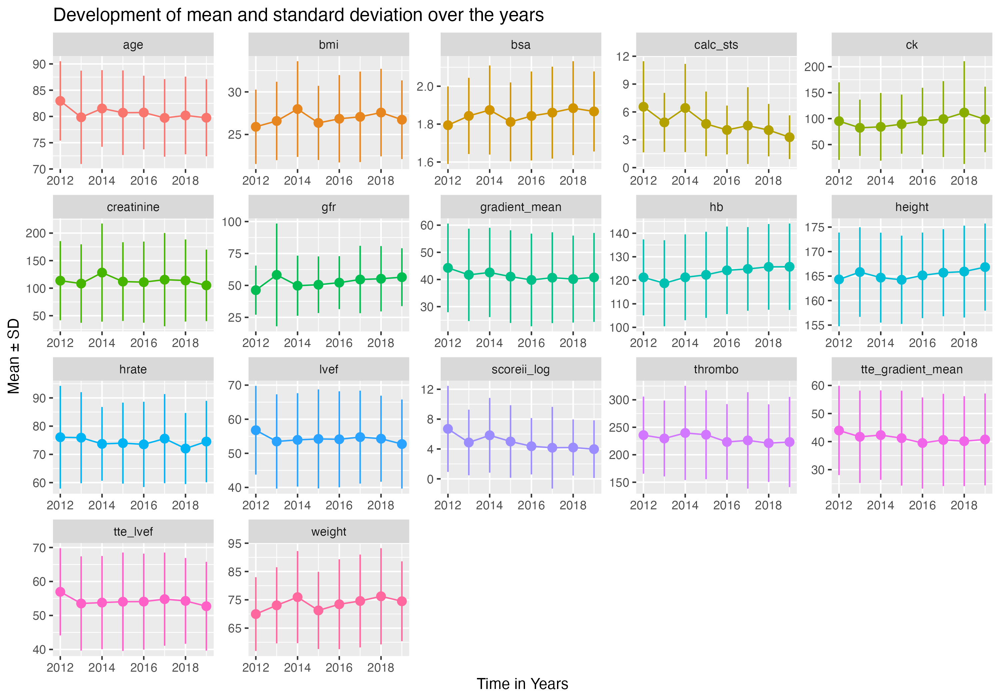
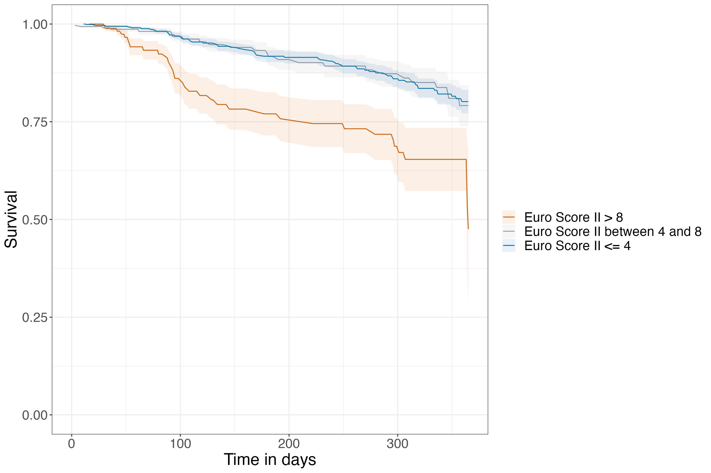

# TaviScore

Clean repository of my Bachelor's Thesis about Developing a Developing a One-Year Risk Score for Transcatheter Aortic Valve Implantation

Main stuff is in 02_models

## 00 Data preparation

1.  Execute `create_time2event.R`
2.  For follow-up distribution plots, execute `FUP_plots.R`

3.  Basic parameter plots are in `parameter_plots_basic.R`

  

4.  Parameter plots stratified by risk (STS scores \<=4, \>8) are in´`parameter_plots_riskstratified.R` 

## 01 Statistical analysis

Execute `statistical_analyses.R`. T-test results:

| name          | p.value              | p.adjustBH   | significantBH | p.adjustbonferroni | significantbonferroni |
|------------|------------|------------|------------|------------|------------|
| age           | 0.0125234257768774   | 0.0268359124 | 1             | 0.188              | 1                     |
| height        | 0.482935928103082    | 0.4829359281 | 0             | 1                  | 0                     |
| weight        | 0.227478736745308    | 0.2938234259 | 0             | 1                  | 0                     |
| bmi           | 0.0671981859432215   | 0.1119969766 | 0             | 1                  | 0                     |
| bsa           | 0.31569220140739     | 0.3382416444 | 0             | 1                  | 0                     |
| scoreii_log   | 0.000396318907582548 | 0.0019815945 | 1             | 0.006              | 1                     |
| calc_sts      | 2.1602992412237e-05  | 0.0001620224 | 1             | 0                  | 1                     |
| creatinine    | 0.00190886280521956  | 0.0071582355 | 1             | 0.029              | 1                     |
| gfr           | 0.0274026651295069   | 0.0513799971 | 0             | 0.411              | 0                     |
| hb            | 1.22251732928169e-06 | 1.83378e-05  | 1             | 0                  | 1                     |
| thrombo       | 0.300436060446901    | 0.3382416444 | 0             | 1                  | 0                     |
| ck            | 0.0854377356608728   | 0.1281566035 | 0             | 1                  | 0                     |
| hrate         | 0.235058740756237    | 0.2938234259 | 0             | 1                  | 0                     |
| gradient_mean | 0.00278155195625097  | 0.0083446559 | 1             | 0.042              | 1                     |
| lvef          | 0.00762988047802821  | 0.0190747012 | 1             | 0.114              | 1                     |

Some Fisher's exact test results:

| name             | p.value              | p.adjustBH   | significantBH | p.adjustbonferroni | significantbonferroni |
|------------|------------|------------|------------|------------|------------|
| sex              | 0.0183086768861968   | 0.0651196902 | 0             | 1                  | 0                     |
| diab             | 0.0330957099873782   | 0.1049932869 | 0             | 1                  | 0                     |
| hyper            | 0.509051870376169    | 0.6787358272 | 0             | 1                  | 0                     |
| dyslip           | 0.573318859356573    | 0.724717356  | 0             | 1                  | 0                     |
| copd             | 0.00105187120823079  | 0.0120965189 | 1             | 0.097              | 0                     |
| cerebro          | 1                    | 1            | 0             | 1                  | 0                     |
| cerebro_strokebl | 0.860437851780319    | 0.909888303  | 0             | 1                  | 0                     |
| pacemaker        | 0.21658203256523     | 0.3985109399 | 0             | 1                  | 0                     |
| valvulo          | 0.694732127232969    | 0.7890784655 | 0             | 1                  | 0                     |
| cad              | 0.398692710469582    | 0.6113288227 | 0             | 1                  | 0                     |
| pci              | 0.377984155566603    | 0.6102106167 | 0             | 1                  | 0                     |
| mi               | 0.0102112330033713   | 0.0391430598 | 1             | 0.939              | 0                     |
| ad               | 2.45400259120383e-06 | 0.0001128841 | 1             | 0                  | 1                     |
| csurgery         | 0.431826404033876    | 0.6306036376 | 0             | 1                  | 0                     |

## 02 Models

### Model plots: Problem: STS and EuroSCORE II cannot distinguish between intermediate and low risk patients

 

We decided on `Lasso_smaller.R` for all patients, and `Lasso_intermed_low.R` for patients with STS scores \<= 8.

### Small model: n= 1434, number of events= 124

|                 | coef      | exp(coef) | se(coef) | z      | Pr(\>\|z\| |        |
|-----------------|-----------|-----------|----------|--------|------------|--------|
| sex             | 0.613995  | 1.847799  | 0.192114 | 3.196  | 0.001394   | \*\*   |
| age             | 0.044255  | 1.045249  | 0.013778 | 3.212  | 0.001318   | \*\*   |
| ad              | 0.735021  | 2.085526  | 0.204445 | 3.595  | 0.000324   | \*\*\* |
| copd            | 0.635212  | 1.887422  | 0.224876 | 2.825  | 0.004732   | \*\*   |
| medi_diuretic   | 0.473712  | 1.605944  | 0.219912 | 2.154  | 0.031233   | \*     |
| hb              | -0.018002 | 0.982159  | 0.004919 | -3.660 | 0.000252   | \*\*\* |
| regurg_mitral34 | 0.606873  | 1.834686  | 0.190928 | 3.179  | 0.001480   | \*\*   |

| Measure               | Value                  |
|-----------------------|------------------------|
| Concordance           | 0.732 (se = 0.023 )    |
| Likelihood ratio test | 79.04 on 7 df, p=2e-14 |
| Wald test             | 79.31 on 7 df, p=2e-14 |
| Score (logrank) test  | 84.79 on 7 df, p=1e-15 |
| 10 fold CV            | 0.7185                 |
| Mean permutation test | 0.5861                 |

### Intermediate/low model: n= 1268, number of events= 93

|                    | coef      | exp(coef) | se(coef) | z      | Pr(\>\|z\| |        |
|-----------|-----------|-----------|-----------|-----------|-----------|-----------|
| sex                | 0.699172  | 2.012087  | 0.231422 | 3.021  | 0.002518   | \*\*   |
| copd               | 0.490690  | 1.633443  | 0.272610 | 1.800  | 0.071866   | .      |
| ad                 | 0.485754  | 1.625400  | 0.250047 | 1.943  | 0.052059   | .      |
| medi_diuretic      | 0.491276  | 1.634400  | 0.243235 | 2.020  | 0.043409   | \*     |
| hb                 | -0.018414 | 0.981754  | 0.005561 | -3.312 | 0.000928   | \*\*\* |
| ccs_stratified     | -0.536056 | 0.585051  | 0.265223 | -2.021 | 0.043264   | \*     |
| regurg_tricuspid34 | 0.724856  | 2.064434  | 0.298633 | 2.427  | 0.015214   | \*     |
| regurg_mitral34    | 0.211762  | 1.235854  | 0.250415 | 0.846  | 0.397752   |        |

| Measure               | Value                  |
|-----------------------|------------------------|
| Concordance           | 0.713 (se = 0.028 )    |
| Likelihood ratio test | 50.1 on 8 df, p=4e-08  |
| Wald test             | 52.68 on 8 df, p=1e-08 |
| Score (logrank) test  | 55.91 on 8 df, p=3e-09 |
| 10 fold CV            | 0.688                  |
| Mean permutation test | 0.5747                 |

#### Use model to predict "new" data from high risk patients

Just predicting it does not work so well

Confusion Matrix and Statistics

|              | Reference=0 | Reference=1 |
|--------------|-------------|-------------|
| Prediction=0 | 133         | 30          |
| Prediction=1 | 2           | 1           |

Patients with high STS scores also have higher linear predictors but the range of STS scores within each hazard category is high. The new data gets sorted into the high and intermediate hazard categories.

  

|                     | N   | Observed | Expected | (O-E)\^2/E | (O-E)\^2/V |
|---------------------|-----|----------|----------|------------|------------|
| hazard=high         | 103 | 26       | 19.41    | 2.23       | 6.04       |
| hazard=intermediate | 62  | 4        | 11.41    | 4.81       | 7.69       |
| hazard=low          | 1   | 1        | 0.18     | 3.74       | 3.78       |

## 03 Test set: cohort from other geographical location

The analysis is in [the R notebook](03_testset/evaluate_on_test_cohort.md)
